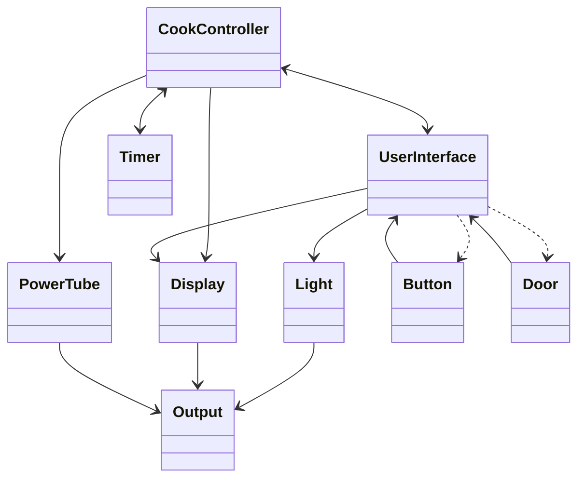
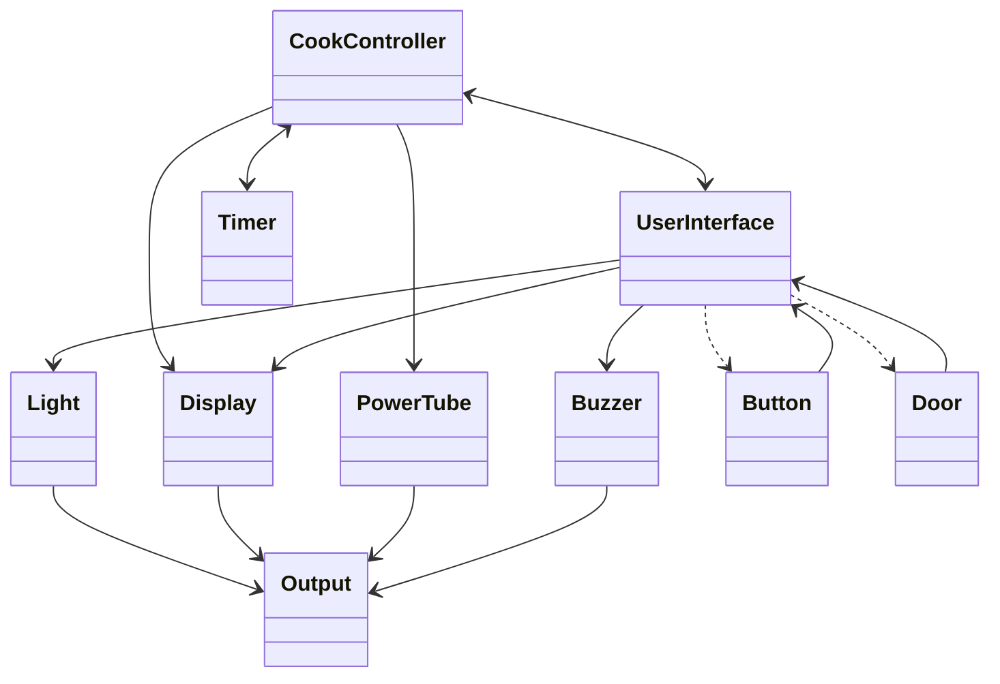
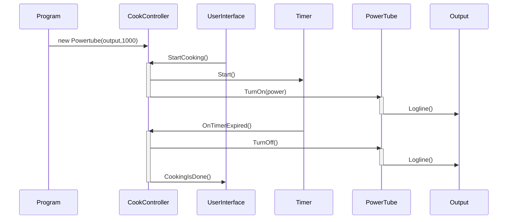
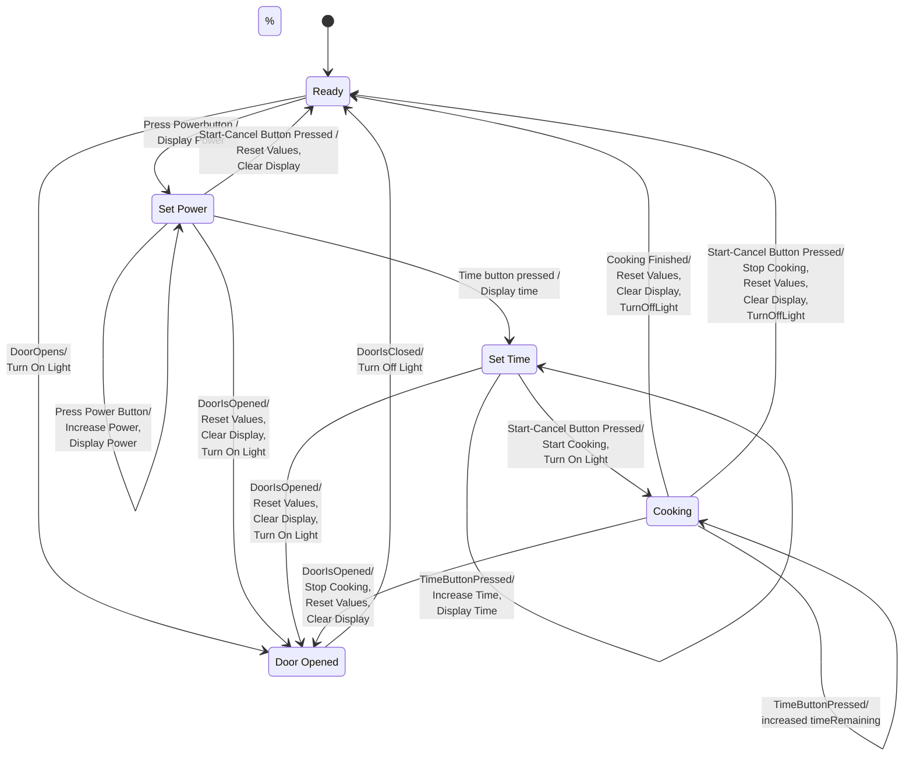

# SWTE22-1-Obligatorisk-Handin-3

ClassDiagram of the MicrowaveOven handout

ClassDiagram with the Buzzer added

SequenceDIagram with the Powertube power configurable

Sequence diagram of buzzer feature

place sequence diagram here

#State machine of the user interface

## Links
[Overleaf](https://www.overleaf.com/1737167548rmbtcmxshxtp)

