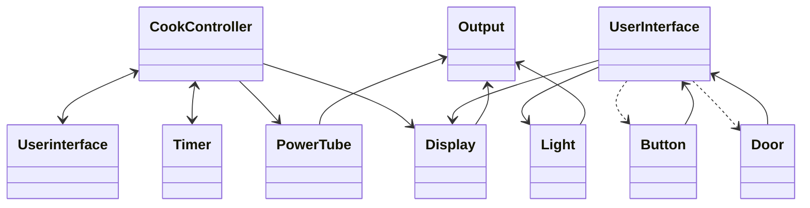
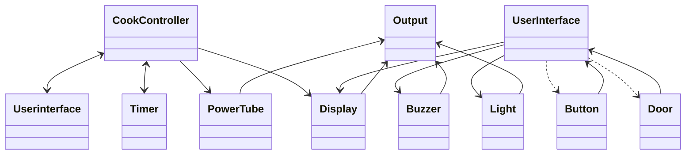

# SWTE22-1-Obligatorisk-Handin-3

ClassDiagram of the MicrowaveOven handout

```mermaid
classDiagram
CookController<-->Userinterface
CookController<-->Timer
CookController-->PowerTube
CookController-->Display
UserInterface-->Display
UserInterface-->Light
UserInterface..>Button
UserInterface..>Door
UserInterface<--Button
UserInterface<--Door
Output<--Light
Output<--Display
Output<--PowerTube
```

ClassDiagram with the Buzzer added

```mermaid
classDiagram
CookController<-->Userinterface
CookController<-->Timer
CookController-->PowerTube
CookController-->Display
UserInterface-->Buzzer
UserInterface-->Display
UserInterface-->Light
UserInterface..>Button
UserInterface..>Door
UserInterface<--Button
UserInterface<--Door
Output<--Light
Output<--Display
Output<--PowerTube
Output<--Buzzer
```