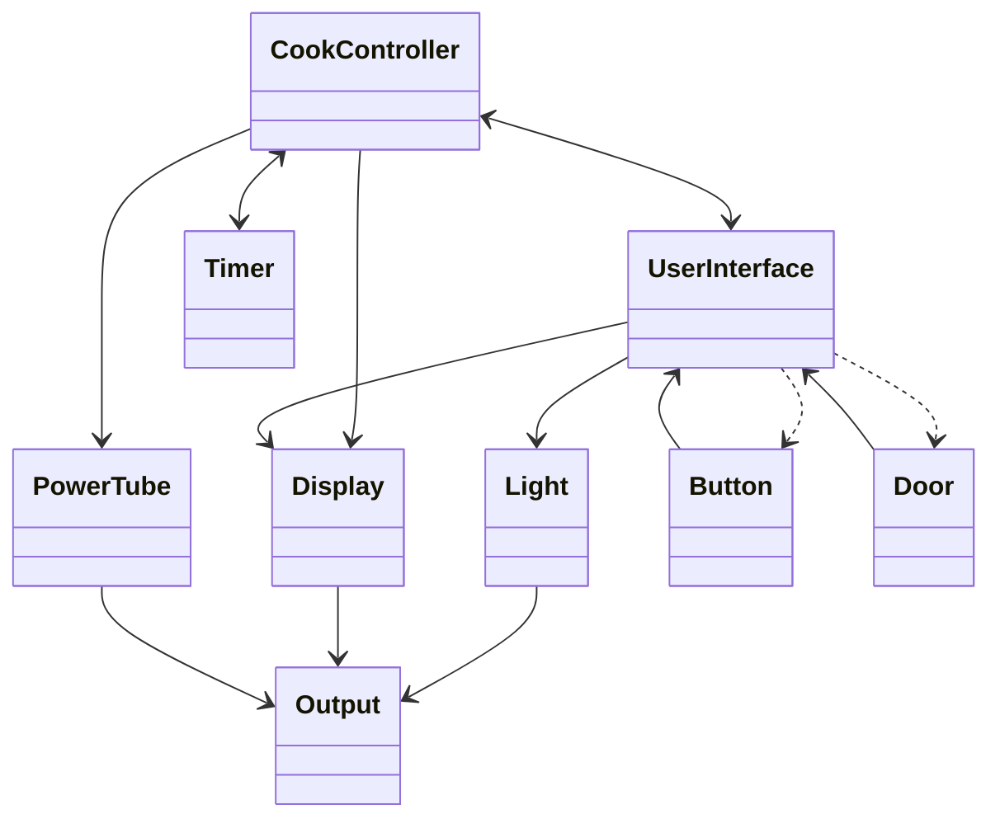
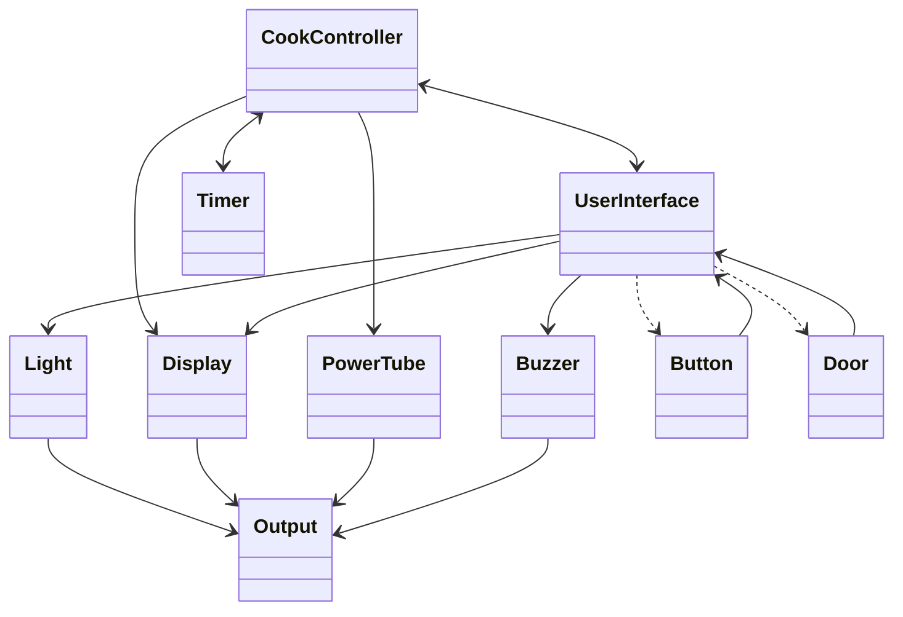
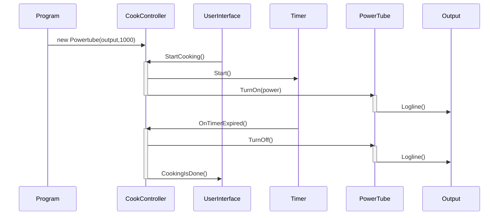

# SWTE22-1-Obligatorisk-Handin-3

ClassDiagram of the MicrowaveOven handout

ClassDiagram with the Buzzer added

SequenceDIagram with the Powertube power configurable

## Links
[Overleaf](https://www.overleaf.com/1737167548rmbtcmxshxtp)

